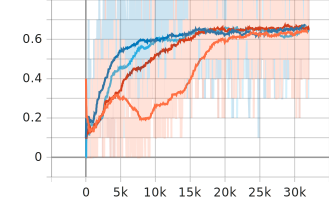
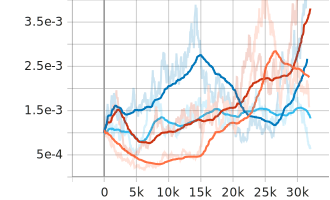
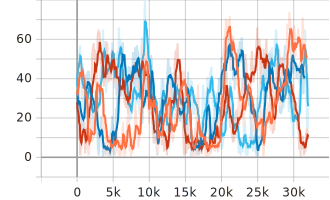
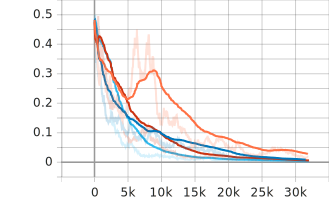
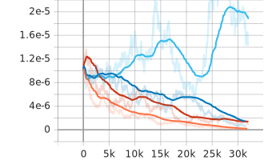
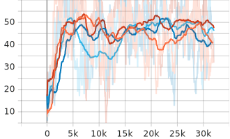
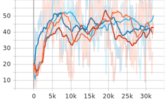
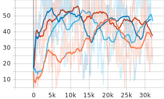

# NeuroEvolution

A hybrid optimization algorithm combining gradient descent for network parameter optimization 
coupled with an evolutionary algorithm for network topology and training hyperparameter 
optimization.

## Results

The following graphs show four test runs. All runs used the same set of initial hyperparameters for
a fully connected neural network trained on the Fashion-MNIST dataset.

### Metrics
|  |  |
|-----------------------------------------------------------------|---------------------------------------------------------------------|
| Test loss                                                       | Test accuracy                                                       |

### Hyperparameters

#### Parameter optimization

|  |  |  |  |
|---------------------------------------------------------------------|------------------------------------------------------------------|---------------------------------------------------------------------|------------------------------------------------------------------|
| Learning rate                                                       | Batch size                                                       | Dropout rate                                                       | Weight decay                                                       |

#### Network topology

|  |  |  |  |
|---------------------------------------------------------------------|-------------------------------------------------------------------------------------|-------------------------------------------------------------------------------------|-------------------------------------------------------------------------------------|
| Neurons hidden layer 1                                                      | Neurons hidden layer 2                                                                      | Neurons hidden layer 3                                                                      | Neurons hidden layer 4                                                                      |

## Networks

Currently, only fully-connected neural networks (Multilayer perceptrons (MLPs)) are supported.

## Mutation operators

This implementation comes with different types of mutation operators for hyperparameter and network 
topology optimization. Although genetic optimization already works reasonably well with these simple 
rules, many improvements are conceivable.

### Proportional mutation

The Proportional Mutation Operator changes the hyperparameter's value proportionally to the value's
size. The rate of change is defined by the `local_mutation_rate` parameter.

```python
eta = rand_sign() * value * local_mutation_rate
value = value + eta
```

### Discrete mutation

The Discrete Mutation Operator changes the hyperparameter's value according to a predefined step
size.

```python
eta = rand_sign() * step_size
value = value + eta
```

## Random subset dataloader

To speed up genetic optimization, a custom dataloader allows to train every epoch on a new set of
randomly selected data coming from the original dataset using a random mapping from subset indices
to original dataset indices:

```python
subset_length = int(len(data) * subset_ratio)
rand_map = random.sample(list(range(len(data))), subset_length)
```

Random subsets are also used for testing the current population to further accelerate the genetic
optimization process. Setting the random subset ratio to small values such as 1 % significantly 
accelerates optimization.
